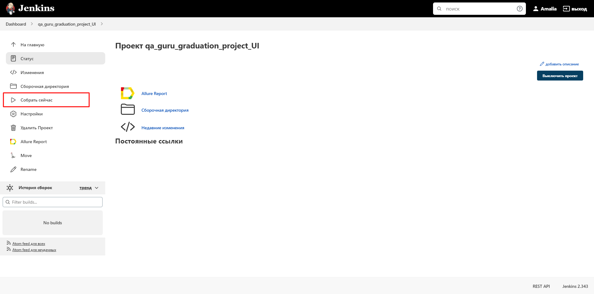
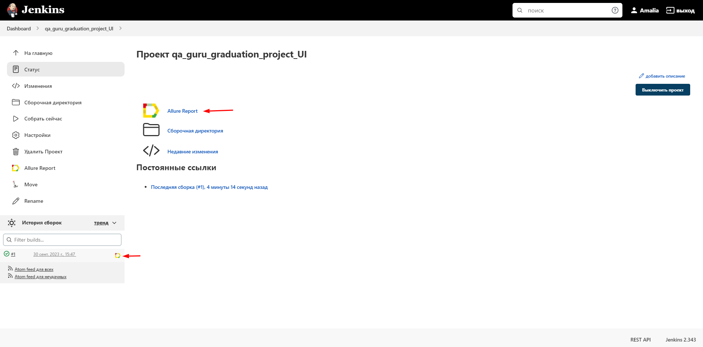
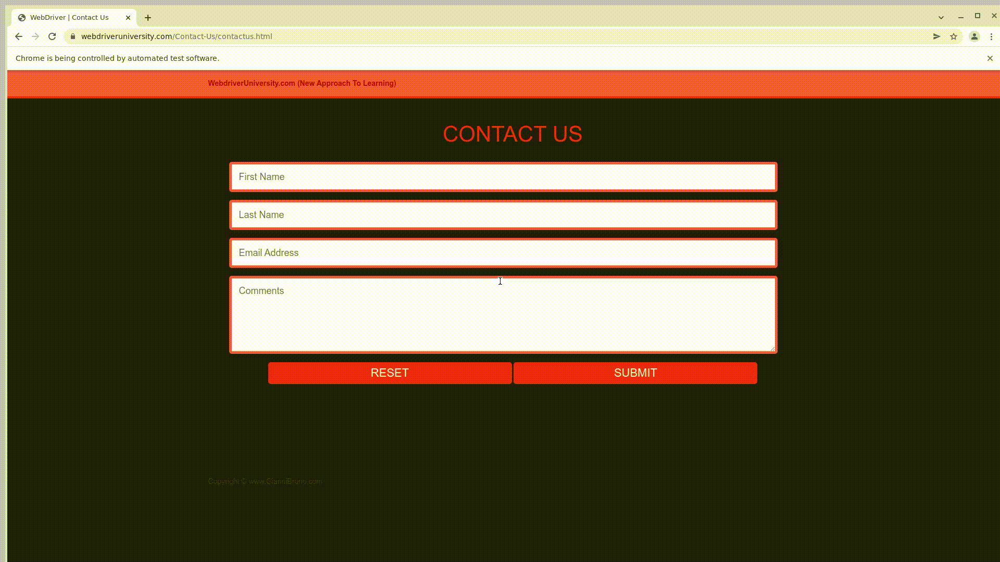
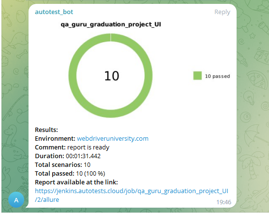

# Пример проекта UI автотестов на демо-сайте "webdriveruniversity.com"
> WebDriverUniversity.com - это набор обучающих страниц с элементами, с которыми можно взаимодействовать.

### Используемые технологии
<p  align="center">
  <code></code>
  <code></code>
  <code></code>
  <code></code>
  <code></code>
  <code></code>
  <code></code>
  <code></code>
  <code></code>
  <code></code>
</p>

## Покрываемый функционал
- Проверка раскрытия и содержимой информации на странице с аккордеоном
- Проверка страницы c кнопками и модальными окнами
- Проверка страницы cо списком задач (добавление/вычеркивание)
- Проверка страницы с обратной связью


## Запуск тестов
#### По умолчанию все тесты запускаются удалённо на Selenoid

### Для локального запуска
1. Склонируйте репозиторий
2. Откройте проект в PyCharm
3. Введите в териминале команду
``` 
python -m venv .venv
source .venv/bin/activate
pip install -r requirements.txt
pytest .
```

### Запуск тестов в [Jenkins](https://jenkins.autotests.cloud/job/qa_guru_graduation_project_UI/)
Нажмите кнопку «Собрать сейчас»
<p></p>

###  Отчетность о прохождении тестов в Allure
#### Если тест запускался локально:
Введите в терминале команду 
```
allure serve allure-results
``` 
#### Если тест запускался в Jenkins
Нажмите Allure Report или кликните по иконке отчёта в завершённой сборке
<p></p>

### Примеры отображения тестов


#### Так же в отчетах для каждого UI-теста прикрепляется видео


### <p> Telegram</p>
<p>Настроена отправка отчета в Telegram</p>
